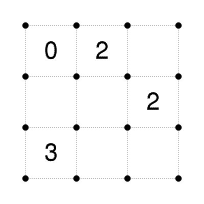
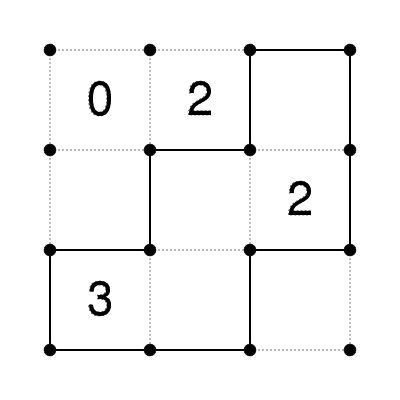
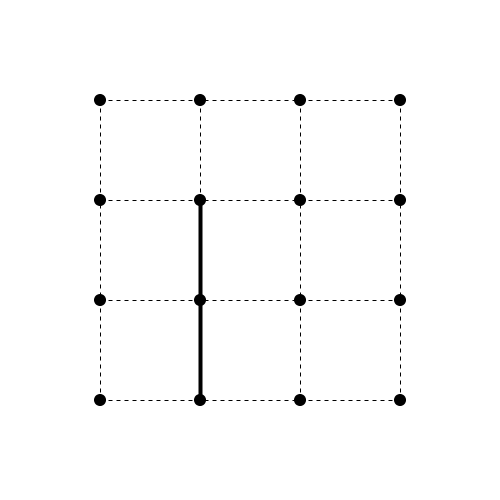
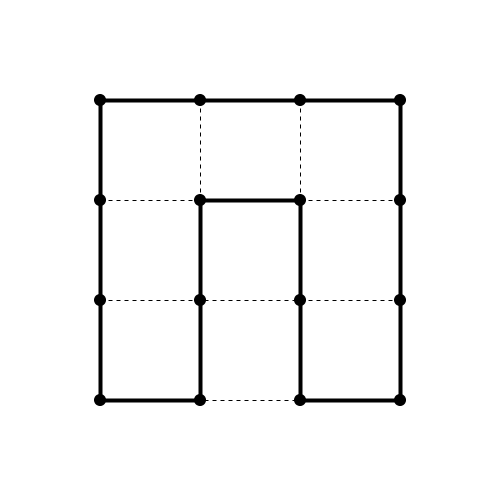
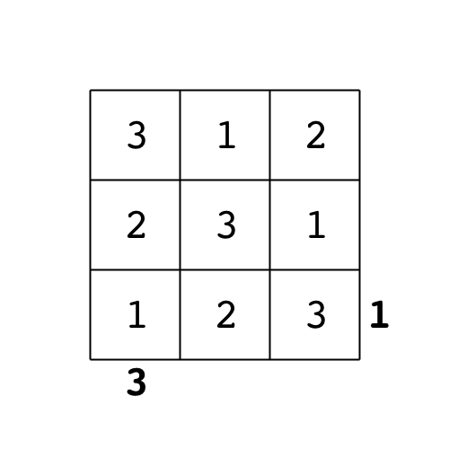

# Solving Puzzles with Python

.fx: title-slide middle

 

    <a href="http://in.pycon.org/2012/" class="conf">PyCon India 2012</a>
     
    September 28, 2011

 
 

    <a class="author" href="http://anandology.com/">Anand Chitipothu</a>
     
    <a href="http://twitter.com/anandology" class="download-slides">@anandology</a>

 
 
 

---
# Overview

* Towers of hanoi
    * [Learn recursion]
* The eight queens puzzle
    * [Compute permutations]
    * Finding just one solution
    * [Learn generators and generator expressions]
* The sudoku puzzle
* More puzzles

---

# Towers of Hanoi

<a href="https://en.wikipedia.org/wiki/Tower_of_Hanoi">https://en.wikipedia.org/wiki/Tower_of_Hanoi</a>

---

# Towers of Hanoi

* Move all but the last disk from A to B
* Move the remaining disk from A to C
* Move all the disks on B to C

---

# Towers of Hanoi

    !python
    def move(disks, src, dest, intermediate):
        if not disks:
            return
        move(disks[1:], src, intermediate, dest)
        movedisk(disk[0], src, dest)
        move(disks[1:], intermediate, dest, src)
    
    def movedisk(disk, src, dest):
        print "move %d from %s to %s" % (disk, src, dest)

    if __name__ == "__main__":
        move([3, 2, 1], "A", "B", "C")
            
---

# Recursion

---

# Recursion: Exponent

    !python
    def exponent(x, n):
        # ...
        pass

---

# Recursion: Exponent

    !python
    def exponent(x, n):
        if n == 0:
            return 1
        else:
            return x * exponent(x, n-1)

---

# Recursion: Fast Exponent

    !python
    def fast_exponent(x, n):
        if n == 0:
            return 1
        elif n % 2 == 0:
            return exponent(x*x, n/2)
        else:
            return x * exponent(x, n-1)

---
# Recursion: Count Change

How to make change of 100 using denominations 50 and 25?

    50 + 50
    50 + 25 + 25
    25 + 25 + 25
    
    3 ways

---

# Recursion: Count Change

How to make change of 100 using denominations 50, 20 and 10?

    2 * 50 + 0 * 20 + 0 * 20
    1 * 50 + 2 * 20 + 1 * 10
    1        1        3
    1        0        5
    0        5        0
    0        4        2
    0        3        4
    0        2        6
    0        1        8
    0        0        10

    10 different ways

---

# Recursion: Count Change

How to make change of 100 using denominations 50, 25, 10, 5 and 1?

Too tedious to try it manually. We need to write a program!

---

# Recursion: Count Change

The number of ways to change amount `A` is equal to:

* the number of ways to change amount `A` using all but the largest coin, plus
* the number of ways to change amount `A - D` using all kinds of coins, where `D` is the denomination of the largest kind of coin.

---

# Recursion: Count Change

    !python
    def count_change(amount, coins):
        """Find the number of ways to change amount using the specified
        coin denominations.

        Assume that the denominations are specified in the descending order.
        """
        # ...

---

# Recursion: Count Change

    !python
    def count_change(amount, coins):
        if amount == 0:
            return 1
        elif amount < 0:
            return 0
        elif len(coins) == 0:
            return 0
        else:
           return count_change(amount-coins[0], coins) + \
                  count_change(amount, coins[1:])

Lets try some examples.

    >>> count_change(50, [50, 25, 10, 5])
    11
    >>> count_change(50, [50, 25, 10, 5, 1])
    50
    >>> count_change(100, [50, 25, 10, 5, 1])
    292
    >>> count_change(200, [50, 25, 10, 5, 1])
    2435
    >>> count_change(200, [50, 25, 10, 5, 2, 1])
    58030
---

# Solving the 8-queen puzzle

---

# Brute-force

* Compute all possible positions
* keep the ones that are valid solutions

---

# How to compute permutaions?

---

# Finding just one solution

---

# Generators & Generator Expressions

---

## Generators

Generators simplifies creation of iterators.

    !python
    def yrange(n):
        i = 0
        while i < n:
            yield i
            i += 1

Lets try it out.

    !python
    >>> y = yrange(3)
    >>> y.next()
    0
    >>> y.next()
    1
    >>> y.next()
    2
    >>> y.next()
    Traceback (most recent call last):
      File "<stdin>", line 1, in <module>
      File "<stdin>", line 14, in next
    StopIteration

    >>> list(yrange(3))
    [0, 1, 2]

---

## More Generators

    !python
    def integers():
        i = 1
        while True:
            yield i
            i = i + 1

    def squares():
        for i in integers():
            yield i * i

    def take(n, seq):
        """Returns first n values from the given sequence."""
        seq = iter(seq)
        result = []
        try:
            for i in range(n):
                result.append(seq.next())
        except StopIteration:
            pass
        return result

Lets try it.

    !python
    >>> take(5, squares())
    [1, 4, 9, 16, 25]
---

## Generator Expressions

Generator expressions take generators to the next level.

See improved versions of `squares` and `take` functions using generator expressions.
    
    !python
    def integers():
        i = 1
        while True:
            yield i
            i = i + 1

    def squares():
        return (i*i for i in integers())

    def take(n, seq):
        seq = iter(seq)
        return list(seq.next() for i in range(n))

See it in action.

    !python
    >>> take(5, squares())
    [1, 4, 9, 16, 25]

---

## Lazy Permutations

    !python
    def permutations(xs):
        if not xs:
            return [[]]
        else:
            return ([x] + xs1 for x in xs
                              for xs1 in permutations(remove(x, xs)))

Lets try it:

    >>> p = permutations(range(5))
    >>> p.next()
    [0, 1, 2, 3, 4]
    >>> p.next()
    [0, 1, 2, 4, 3]
    >>> p.next()
    [0, 1, 3, 2, 4]

---

## Finding just single solution to 8-queens

&nbsp;
    
---

# Sudoku

---

# How to Solve Sudoku

Ideas?

---

# How to Solve Sudoku (2)

Recursively!

---

# How to Solve Sudoku (3)

* find empty position
* find all the possible values there
* for each possible value:
    * place that value there
    * solve the rest of the puzzle

---

# Sudoku - solver

    !python
    def solve(grid):
        pos = find_empty_position(grid) 
        if not pos:
            return grid

        ri, ci = pos
        for n in find_possible_values(grid, pos):
            grid[ri][ci] = n
            soln = solve(grid)
            if soln:
                return soln

        # failed to find a solution
        # put the original value back
        grid[ri][ci] = '.'

    # sample puzzle are at http://magictour.free.fr/msk_009

---
# Sudoku - Find empty position 

    !python
    def find_empty_position(grid):
        for row in range(9):
            for col in range(9):
                if grid[row, col] == '.':
                    return (row, col)

---
# Sudoku - Find possible values

    !python
    def find_possible_values(grid, pos):
        return set("123456789") - \
                set(get_row(grid, pos)) - \
                set(get_col(grid, pos)) - \
                set(get_block(grid, pos))

---
# More Puzzles

---
# Fence Puzzle

    
    
     

<http://anandology.com/stream/2009/12/fence/puzzle.html>

---
# Loop Puzzle

    
    
     

<http://anandology.com/stream/2010/01/loop/>

---
# Sky Scrapers

    
    
     

<http://anandology.com/stream/2010/01/skyscrapers/>

---

# Questions?

Slides and code is available at:

<http://github.com/anandology/solving-puzzles-with-python>
